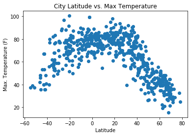
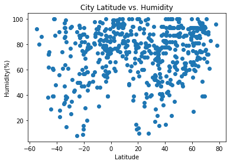
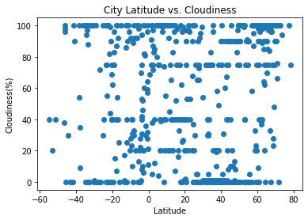
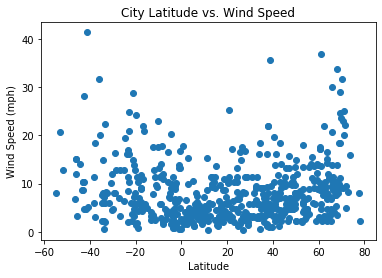

# WeatherPy
----

#### Note
* Instructions have been included for each segment. You do not have to follow them exactly, but they are included to help you think through the steps.


```python
# 
# !pip install citipy
```


```python
# Dependencies and Setup
import matplotlib.pyplot as plt
import pandas as pd
import numpy as np
import requests
import time

# Import API key
from api_keys import api_key

#Install Packages for jupyter monitor
#!pip install citipy

# Incorporated citipy to determine city based on latitude and longitude
from citipy import citipy

# Output File (CSV)
output_data_file = "output_data/cities.csv"

# Range of latitudes and longitudes
lat_range = (-90, 90)
lng_range = (-180, 180)
```

## Generate Cities List


```python
# List for holding lat_lngs and cities
lat_lngs = []
cities = []

# Create a set of random lat and lng combinations
lats = np.random.uniform(low=-90.000, high=90.000, size=1500)
lngs = np.random.uniform(low=-180.000, high=180.000, size=1500)
lat_lngs = zip(lats, lngs)

# Identify nearest city for each lat, lng combination
for lat_lng in lat_lngs:
    city = citipy.nearest_city(lat_lng[0], lat_lng[1]).city_name
    
    # If the city is unique, then add it to a our cities list
    if city not in cities:
        cities.append(city)

# Print the city count to confirm sufficient count
len(cities)
```


    617


```python
#cities = ("London", "Paris", "Chicago", "New York")
```

### Perform API Calls
* Perform a weather check on each city using a series of successive API calls.
* Include a print log of each city as it'sbeing processed (with the city number and city name).


```python
#url = "http://api.openweathermap.org/data/2.5/weather?"
# Build query URL based on current element in units
#query_url = url + "appid=" + api_key + "&q=" + city + "&units=Imperial"

url = "http://api.openweathermap.org/data/2.5/weather?appid=" + api_key

# set up list to hold the different city names
city_name = []
cloudiness = []
country = []
date = []
humidity = []
lat = []
lng = []
max_temp = []
wind_speed = []

loop = 0

# loop throught the list of cities and append them to an api call

for city in cities:
  
    # Try statement to append calls where value is found 
    try:
        response = requests.get(f"{url}&q={city}&units=Imperial").json() 
        
        city_name.append(response["name"])
        cloudiness.append(response["clouds"]["all"])
        country.append(response["sys"]["country"])
        date.append(response["dt"])
        humidity.append(response["main"]["humidity"])
        max_temp.append(response["main"]["temp_max"])
        lat.append(response["coord"]["lat"])
        lng.append(response["coord"]["lon"])
        wind_speed.append(response["wind"]["speed"])
 
        # Increasing counter by one 
        loop = loop + 1
        
        #print(f"{url}&q={city}")
        print(f"Processing Record {loop} of {len(cities)} for {city}")
        
        # Delays for 1 second. 
        time.sleep(1)
    
    except:    
    
        print("City not found, skipping...")
    
    continue


```

    Processing Record 1 of 617 for butaritari
    Processing Record 2 of 617 for puerto baquerizo moreno
    Processing Record 3 of 617 for tasiilaq
    Processing Record 4 of 617 for mahebourg
    City not found, skipping...
    Processing Record 5 of 617 for vanimo
    Processing Record 6 of 617 for hermanus
    Processing Record 7 of 617 for bundaberg
    Processing Record 8 of 617 for albany
    City not found, skipping...
    Processing Record 9 of 617 for rincon
    City not found, skipping...
    Processing Record 10 of 617 for cabo san lucas
    Processing Record 11 of 617 for chuy
    Processing Record 12 of 617 for ribeira grande
    Processing Record 13 of 617 for punta arenas
    Processing Record 14 of 617 for rikitea
    Processing Record 15 of 617 for tuktoyaktuk
    Processing Record 16 of 617 for luanda
    Processing Record 17 of 617 for saint-ambroise
    Processing Record 18 of 617 for ayan
    City not found, skipping...
    Processing Record 19 of 617 for port blair
    Processing Record 20 of 617 for avarua
    Processing Record 21 of 617 for nouadhibou
    Processing Record 22 of 617 for hilo
    Processing Record 23 of 617 for ust-kuyga
    City not found, skipping...
    Processing Record 24 of 617 for busselton
    Processing Record 25 of 617 for tamasopo
    City not found, skipping...
    City not found, skipping...
    Processing Record 26 of 617 for ilulissat
    Processing Record 27 of 617 for bluff
    City not found, skipping...
    Processing Record 28 of 617 for prainha
    City not found, skipping...
    Processing Record 29 of 617 for hobart
    Processing Record 30 of 617 for cape town
    Processing Record 31 of 617 for georgetown
    City not found, skipping...
    Processing Record 32 of 617 for jamestown
    Processing Record 33 of 617 for tchamba
    Processing Record 34 of 617 for vaini
    Processing Record 35 of 617 for mataura
    Processing Record 36 of 617 for sao miguel do araguaia
    Processing Record 37 of 617 for clyde river
    Processing Record 38 of 617 for magan
    Processing Record 39 of 617 for anjad
    Processing Record 40 of 617 for matara
    Processing Record 41 of 617 for stephenville
    Processing Record 42 of 617 for barrow
    Processing Record 43 of 617 for ushuaia
    Processing Record 44 of 617 for novyy urengoy
    Processing Record 45 of 617 for leningradskiy
    Processing Record 46 of 617 for mar del plata
    Processing Record 47 of 617 for saint-philippe
    City not found, skipping...
    Processing Record 48 of 617 for namatanai
    Processing Record 49 of 617 for upernavik
    Processing Record 50 of 617 for saldanha
    Processing Record 51 of 617 for puerto ayora
    Processing Record 52 of 617 for cotonou
    Processing Record 53 of 617 for iqaluit
    City not found, skipping...
    Processing Record 54 of 617 for margate
    Processing Record 55 of 617 for kurilsk
    Processing Record 56 of 617 for saint-pierre
    Processing Record 57 of 617 for shaunavon
    Processing Record 58 of 617 for port alfred
    Processing Record 59 of 617 for arraial do cabo
    Processing Record 60 of 617 for saint george
    Processing Record 61 of 617 for kabansk
    Processing Record 62 of 617 for victoria
    Processing Record 63 of 617 for campbell river
    Processing Record 64 of 617 for lebedyn
    Processing Record 65 of 617 for qasigiannguit
    Processing Record 66 of 617 for basco
    Processing Record 67 of 617 for havre-saint-pierre
    Processing Record 68 of 617 for sorong
    Processing Record 69 of 617 for norrkoping
    Processing Record 70 of 617 for laem sing
    Processing Record 71 of 617 for dakar
    Processing Record 72 of 617 for whitehorse
    Processing Record 73 of 617 for huarmey
    Processing Record 74 of 617 for kapaa
    Processing Record 75 of 617 for chokurdakh
    Processing Record 76 of 617 for yantai
    Processing Record 77 of 617 for college
    Processing Record 78 of 617 for qaanaaq
    Processing Record 79 of 617 for svetlogorsk
    Processing Record 80 of 617 for yellowknife
    Processing Record 81 of 617 for abonnema
    Processing Record 82 of 617 for luderitz
    Processing Record 83 of 617 for okakarara
    Processing Record 84 of 617 for kholodnyy
    Processing Record 85 of 617 for katsuura
    Processing Record 86 of 617 for esperance
    Processing Record 87 of 617 for ishigaki
    Processing Record 88 of 617 for tacuati
    Processing Record 89 of 617 for koshurnikovo
    Processing Record 90 of 617 for new norfolk
    Processing Record 91 of 617 for ilorin
    Processing Record 92 of 617 for kouango
    Processing Record 93 of 617 for hamilton
    Processing Record 94 of 617 for coquimbo
    Processing Record 95 of 617 for castro
    City not found, skipping...
    Processing Record 96 of 617 for marsh harbour
    Processing Record 97 of 617 for sao domingos
    Processing Record 98 of 617 for lompoc
    Processing Record 99 of 617 for kilindoni
    Processing Record 100 of 617 for rionero in vulture
    Processing Record 101 of 617 for padang
    Processing Record 102 of 617 for grindavik
    Processing Record 103 of 617 for mount isa
    Processing Record 104 of 617 for salalah
    Processing Record 105 of 617 for kaitangata
    Processing Record 106 of 617 for inarcs
    Processing Record 107 of 617 for cherskiy
    Processing Record 108 of 617 for tigre
    Processing Record 109 of 617 for faya
    Processing Record 110 of 617 for bandarbeyla
    Processing Record 111 of 617 for kota kinabalu
    Processing Record 112 of 617 for tarakan
    City not found, skipping...
    Processing Record 113 of 617 for tubuala
    Processing Record 114 of 617 for gravdal
    Processing Record 115 of 617 for jizan
    Processing Record 116 of 617 for phrae
    Processing Record 117 of 617 for yeppoon
    Processing Record 118 of 617 for talnakh
    Processing Record 119 of 617 for ngunguru
    Processing Record 120 of 617 for kodiak
    Processing Record 121 of 617 for ypsonas
    Processing Record 122 of 617 for binzhou
    Processing Record 123 of 617 for adrar
    Processing Record 124 of 617 for vila franca do campo
    Processing Record 125 of 617 for gazojak
    Processing Record 126 of 617 for santa isabel do rio negro
    Processing Record 127 of 617 for khatanga
    Processing Record 128 of 617 for rocha
    City not found, skipping...
    Processing Record 129 of 617 for borba
    Processing Record 130 of 617 for tashtyp
    City not found, skipping...
    Processing Record 131 of 617 for hithadhoo
    Processing Record 132 of 617 for bayir
    Processing Record 133 of 617 for tabou
    Processing Record 134 of 617 for virginia beach
    Processing Record 135 of 617 for zavodouspenskoye
    Processing Record 136 of 617 for lethem
    Processing Record 137 of 617 for balkhash
    Processing Record 138 of 617 for lermontovka
    Processing Record 139 of 617 for jalu
    Processing Record 140 of 617 for dayong
    City not found, skipping...
    Processing Record 141 of 617 for hay river
    Processing Record 142 of 617 for kavieng
    Processing Record 143 of 617 for caravelas
    Processing Record 144 of 617 for bezhetsk
    Processing Record 145 of 617 for haines junction
    Processing Record 146 of 617 for tigil
    Processing Record 147 of 617 for ueno
    Processing Record 148 of 617 for kruisfontein
    Processing Record 149 of 617 for provideniya
    Processing Record 150 of 617 for cassilandia
    Processing Record 151 of 617 for iraan
    City not found, skipping...
    Processing Record 152 of 617 for yaan
    Processing Record 153 of 617 for alofi
    Processing Record 154 of 617 for beloha
    Processing Record 155 of 617 for bonavista
    Processing Record 156 of 617 for yarovoye
    Processing Record 157 of 617 for yulara
    Processing Record 158 of 617 for mount gambier
    Processing Record 159 of 617 for berlevag
    Processing Record 160 of 617 for airai
    Processing Record 161 of 617 for pandan
    Processing Record 162 of 617 for pevek
    Processing Record 163 of 617 for pyatnitskoye
    Processing Record 164 of 617 for coihaique
    Processing Record 165 of 617 for khonsa
    Processing Record 166 of 617 for enumclaw
    Processing Record 167 of 617 for rantepao
    City not found, skipping...
    Processing Record 168 of 617 for dingle
    Processing Record 169 of 617 for torbay
    Processing Record 170 of 617 for tiksi
    Processing Record 171 of 617 for tucurui
    Processing Record 172 of 617 for kudahuvadhoo
    City not found, skipping...
    Processing Record 173 of 617 for cap malheureux
    Processing Record 174 of 617 for hobyo
    Processing Record 175 of 617 for ingham
    Processing Record 176 of 617 for sangar
    Processing Record 177 of 617 for nome
    Processing Record 178 of 617 for atuona
    Processing Record 179 of 617 for orotukan
    Processing Record 180 of 617 for namibe
    Processing Record 181 of 617 for jimenez
    Processing Record 182 of 617 for walvis bay
    Processing Record 183 of 617 for tongren
    Processing Record 184 of 617 for hailey
    Processing Record 185 of 617 for bredasdorp
    Processing Record 186 of 617 for maine-soroa
    Processing Record 187 of 617 for longyearbyen
    Processing Record 188 of 617 for belyy yar
    Processing Record 189 of 617 for santa maria
    Processing Record 190 of 617 for oriximina
    Processing Record 191 of 617 for dewa
    Processing Record 192 of 617 for pokhara
    City not found, skipping...
    Processing Record 193 of 617 for pyaozerskiy
    Processing Record 194 of 617 for palmer
    Processing Record 195 of 617 for zhangjiakou
    Processing Record 196 of 617 for lebu
    Processing Record 197 of 617 for vila
    Processing Record 198 of 617 for henties bay
    Processing Record 199 of 617 for tha bo
    Processing Record 200 of 617 for nikki
    Processing Record 201 of 617 for vammala
    Processing Record 202 of 617 for la ronge
    Processing Record 203 of 617 for camacha
    Processing Record 204 of 617 for east london
    Processing Record 205 of 617 for araouane
    Processing Record 206 of 617 for calamar
    Processing Record 207 of 617 for moog
    Processing Record 208 of 617 for port elizabeth
    Processing Record 209 of 617 for misratah
    Processing Record 210 of 617 for thompson
    City not found, skipping...
    Processing Record 211 of 617 for hasaki
    Processing Record 212 of 617 for tayu
    Processing Record 213 of 617 for lavrentiya
    City not found, skipping...
    Processing Record 214 of 617 for dumbraveni
    Processing Record 215 of 617 for luena
    Processing Record 216 of 617 for kieta
    Processing Record 217 of 617 for hulan
    Processing Record 218 of 617 for kargasok
    Processing Record 219 of 617 for carnarvon
    Processing Record 220 of 617 for kodino
    City not found, skipping...
    City not found, skipping...
    Processing Record 221 of 617 for auki
    Processing Record 222 of 617 for itoman
    Processing Record 223 of 617 for santa maria da vitoria
    Processing Record 224 of 617 for sioux lookout
    City not found, skipping...
    Processing Record 225 of 617 for srednekolymsk
    Processing Record 226 of 617 for pingliang
    Processing Record 227 of 617 for roald
    Processing Record 228 of 617 for marisel
    Processing Record 229 of 617 for saskylakh
    Processing Record 230 of 617 for turukhansk
    Processing Record 231 of 617 for avera
    Processing Record 232 of 617 for eureka
    Processing Record 233 of 617 for oyama
    Processing Record 234 of 617 for vila velha
    Processing Record 235 of 617 for bilma
    Processing Record 236 of 617 for dembi dolo
    Processing Record 237 of 617 for rawson
    Processing Record 238 of 617 for saint-denis
    Processing Record 239 of 617 for komsomolskiy
    Processing Record 240 of 617 for kitimat
    Processing Record 241 of 617 for hue
    Processing Record 242 of 617 for santa fe
    Processing Record 243 of 617 for brigham city
    Processing Record 244 of 617 for saint anthony
    City not found, skipping...
    Processing Record 245 of 617 for hadgaon
    Processing Record 246 of 617 for alpena
    Processing Record 247 of 617 for vestmannaeyjar
    City not found, skipping...
    Processing Record 248 of 617 for faanui
    Processing Record 249 of 617 for plastun
    Processing Record 250 of 617 for soavinandriana
    Processing Record 251 of 617 for klaksvik
    City not found, skipping...
    City not found, skipping...
    Processing Record 252 of 617 for nebolchi
    Processing Record 253 of 617 for nikolskoye
    City not found, skipping...
    Processing Record 254 of 617 for norman wells
    Processing Record 255 of 617 for canico
    Processing Record 256 of 617 for usinsk
    Processing Record 257 of 617 for port-cartier
    Processing Record 258 of 617 for eydhafushi
    City not found, skipping...
    Processing Record 259 of 617 for hofn
    Processing Record 260 of 617 for byron bay
    Processing Record 261 of 617 for vanavara
    Processing Record 262 of 617 for tura
    Processing Record 263 of 617 for lata
    City not found, skipping...
    City not found, skipping...
    Processing Record 264 of 617 for kapit
    Processing Record 265 of 617 for kahului
    Processing Record 266 of 617 for kazuno
    Processing Record 267 of 617 for tabat
    Processing Record 268 of 617 for poum
    Processing Record 269 of 617 for itarema
    Processing Record 270 of 617 for lac du bonnet
    Processing Record 271 of 617 for fortuna
    Processing Record 272 of 617 for ancud
    Processing Record 273 of 617 for lipari
    Processing Record 274 of 617 for fortuna foothills
    Processing Record 275 of 617 for pawai
    Processing Record 276 of 617 for benguela
    City not found, skipping...
    Processing Record 277 of 617 for san quintin
    Processing Record 278 of 617 for weyburn
    Processing Record 279 of 617 for agutaya
    Processing Record 280 of 617 for sao felix do xingu
    Processing Record 281 of 617 for dikson
    Processing Record 282 of 617 for manaure
    Processing Record 283 of 617 for bambous virieux
    Processing Record 284 of 617 for kuito
    Processing Record 285 of 617 for aurad
    Processing Record 286 of 617 for lezajsk
    Processing Record 287 of 617 for buraydah
    Processing Record 288 of 617 for vao
    Processing Record 289 of 617 for huainan
    Processing Record 290 of 617 for talara
    Processing Record 291 of 617 for bubaque
    Processing Record 292 of 617 for zhigansk
    Processing Record 293 of 617 for verkhnevilyuysk
    Processing Record 294 of 617 for ebenthal
    Processing Record 295 of 617 for riyadh
    Processing Record 296 of 617 for nanortalik
    Processing Record 297 of 617 for qena
    Processing Record 298 of 617 for nsanje
    Processing Record 299 of 617 for seredka
    Processing Record 300 of 617 for regeneracao
    Processing Record 301 of 617 for valle de allende
    Processing Record 302 of 617 for antofagasta
    Processing Record 303 of 617 for linxia
    Processing Record 304 of 617 for tessalit
    Processing Record 305 of 617 for laguna
    Processing Record 306 of 617 for geraldton
    City not found, skipping...
    Processing Record 307 of 617 for kavaratti
    City not found, skipping...
    Processing Record 308 of 617 for cartagena
    Processing Record 309 of 617 for corpus christi
    City not found, skipping...
    Processing Record 310 of 617 for tilichiki
    Processing Record 311 of 617 for vardo
    Processing Record 312 of 617 for bathsheba
    Processing Record 313 of 617 for tadpatri
    Processing Record 314 of 617 for malanje
    Processing Record 315 of 617 for los llanos de aridane
    Processing Record 316 of 617 for mingyue
    Processing Record 317 of 617 for tautira
    Processing Record 318 of 617 for igra
    Processing Record 319 of 617 for thunder bay
    Processing Record 320 of 617 for alekseyevka
    Processing Record 321 of 617 for kemin
    Processing Record 322 of 617 for kupang
    Processing Record 323 of 617 for ostrovnoy
    Processing Record 324 of 617 for yichun
    City not found, skipping...
    Processing Record 325 of 617 for mahanoro
    Processing Record 326 of 617 for constitucion
    City not found, skipping...
    Processing Record 327 of 617 for lakes entrance
    Processing Record 328 of 617 for sao jose da coroa grande
    Processing Record 329 of 617 for fort nelson
    Processing Record 330 of 617 for bethel
    Processing Record 331 of 617 for manta
    Processing Record 332 of 617 for mayo
    City not found, skipping...
    Processing Record 333 of 617 for sao joao da barra
    Processing Record 334 of 617 for bukene
    Processing Record 335 of 617 for talaya
    Processing Record 336 of 617 for mogadishu
    Processing Record 337 of 617 for baymak
    Processing Record 338 of 617 for atar
    Processing Record 339 of 617 for tumkur
    Processing Record 340 of 617 for dongsheng
    City not found, skipping...
    Processing Record 341 of 617 for punta alta
    Processing Record 342 of 617 for chapais
    Processing Record 343 of 617 for malokakhovka
    Processing Record 344 of 617 for guarapari
    Processing Record 345 of 617 for tabatinga
    Processing Record 346 of 617 for nichinan
    Processing Record 347 of 617 for tambovka
    Processing Record 348 of 617 for mitu
    Processing Record 349 of 617 for nagato
    Processing Record 350 of 617 for lagos
    City not found, skipping...
    Processing Record 351 of 617 for miri
    Processing Record 352 of 617 for ebebiyin
    Processing Record 353 of 617 for betanzos
    Processing Record 354 of 617 for goya
    Processing Record 355 of 617 for bowen
    Processing Record 356 of 617 for chuzhou
    City not found, skipping...
    Processing Record 357 of 617 for barabai
    Processing Record 358 of 617 for moskovskiy
    Processing Record 359 of 617 for tulum
    Processing Record 360 of 617 for dong hoi
    Processing Record 361 of 617 for senador pompeu
    Processing Record 362 of 617 for gao
    Processing Record 363 of 617 for birao
    Processing Record 364 of 617 for pervomayskoye
    City not found, skipping...
    Processing Record 365 of 617 for sao filipe
    Processing Record 366 of 617 for merauke
    City not found, skipping...
    Processing Record 367 of 617 for kilifi
    Processing Record 368 of 617 for sumbe
    Processing Record 369 of 617 for muroto
    Processing Record 370 of 617 for egvekinot
    Processing Record 371 of 617 for skowhegan
    Processing Record 372 of 617 for tuatapere
    Processing Record 373 of 617 for guerrero negro
    Processing Record 374 of 617 for tolaga bay
    Processing Record 375 of 617 for port hedland
    Processing Record 376 of 617 for worpswede
    Processing Record 377 of 617 for mineiros
    City not found, skipping...
    Processing Record 378 of 617 for yumen
    Processing Record 379 of 617 for yerbogachen
    Processing Record 380 of 617 for aconibe
    Processing Record 381 of 617 for emerald
    Processing Record 382 of 617 for puerto narino
    Processing Record 383 of 617 for fairbanks
    Processing Record 384 of 617 for dhidhdhoo
    Processing Record 385 of 617 for lakeside
    Processing Record 386 of 617 for lorengau
    Processing Record 387 of 617 for nelson bay
    Processing Record 388 of 617 for petropavlovsk-kamchatskiy
    Processing Record 389 of 617 for ous
    Processing Record 390 of 617 for grand gaube
    Processing Record 391 of 617 for bonthe
    Processing Record 392 of 617 for swift current
    Processing Record 393 of 617 for touros
    Processing Record 394 of 617 for kulai
    Processing Record 395 of 617 for tombouctou
    Processing Record 396 of 617 for flin flon
    Processing Record 397 of 617 for poya
    Processing Record 398 of 617 for hamakita
    Processing Record 399 of 617 for paamiut
    Processing Record 400 of 617 for chauk
    Processing Record 401 of 617 for fuyang
    Processing Record 402 of 617 for tutoia
    Processing Record 403 of 617 for quatre cocos
    Processing Record 404 of 617 for labuan
    Processing Record 405 of 617 for lypnyazhka
    Processing Record 406 of 617 for pangody
    Processing Record 407 of 617 for brae
    Processing Record 408 of 617 for manggar
    Processing Record 409 of 617 for myitkyina
    Processing Record 410 of 617 for pacifica
    Processing Record 411 of 617 for kanigoro
    Processing Record 412 of 617 for sironj
    Processing Record 413 of 617 for meulaboh
    Processing Record 414 of 617 for ambasamudram
    Processing Record 415 of 617 for san cristobal
    Processing Record 416 of 617 for iquique
    City not found, skipping...
    Processing Record 417 of 617 for yining
    Processing Record 418 of 617 for codrington
    Processing Record 419 of 617 for hokitika
    Processing Record 420 of 617 for umkomaas
    Processing Record 421 of 617 for dunmore town
    Processing Record 422 of 617 for kenai
    Processing Record 423 of 617 for ponta do sol
    Processing Record 424 of 617 for robertsport
    Processing Record 425 of 617 for nantucket
    Processing Record 426 of 617 for muros
    Processing Record 427 of 617 for yinchuan
    Processing Record 428 of 617 for pahalgam
    Processing Record 429 of 617 for sisimiut
    Processing Record 430 of 617 for altamira
    Processing Record 431 of 617 for porto walter
    Processing Record 432 of 617 for viedma
    Processing Record 433 of 617 for mao
    Processing Record 434 of 617 for bathurst
    Processing Record 435 of 617 for nisia floresta
    Processing Record 436 of 617 for vangaindrano
    Processing Record 437 of 617 for xichang
    Processing Record 438 of 617 for cidreira
    Processing Record 439 of 617 for tucuman
    Processing Record 440 of 617 for diffa
    Processing Record 441 of 617 for sitka
    Processing Record 442 of 617 for santa maria da boa vista
    City not found, skipping...
    City not found, skipping...
    Processing Record 443 of 617 for martigny
    City not found, skipping...
    Processing Record 444 of 617 for isangel
    Processing Record 445 of 617 for dargaville
    Processing Record 446 of 617 for saint-joseph
    Processing Record 447 of 617 for usogorsk
    Processing Record 448 of 617 for teacapan
    Processing Record 449 of 617 for pyay
    Processing Record 450 of 617 for saint andrews
    Processing Record 451 of 617 for san patricio
    Processing Record 452 of 617 for jinsha
    Processing Record 453 of 617 for tual
    City not found, skipping...
    Processing Record 454 of 617 for wittenberge
    Processing Record 455 of 617 for ridgecrest
    Processing Record 456 of 617 for kearney
    Processing Record 457 of 617 for portland
    Processing Record 458 of 617 for lira
    Processing Record 459 of 617 for deputatskiy
    Processing Record 460 of 617 for goundi
    Processing Record 461 of 617 for gat
    Processing Record 462 of 617 for severo-kurilsk
    Processing Record 463 of 617 for ouango
    Processing Record 464 of 617 for ozuluama
    Processing Record 465 of 617 for marsa matruh
    Processing Record 466 of 617 for evans
    Processing Record 467 of 617 for souillac
    Processing Record 468 of 617 for acapulco
    Processing Record 469 of 617 for upata
    Processing Record 470 of 617 for samarai
    Processing Record 471 of 617 for sola
    Processing Record 472 of 617 for hernani
    Processing Record 473 of 617 for basoko
    Processing Record 474 of 617 for ongandjera
    Processing Record 475 of 617 for jiaocheng
    Processing Record 476 of 617 for mandalgovi
    Processing Record 477 of 617 for ambon
    Processing Record 478 of 617 for tarnogskiy gorodok
    Processing Record 479 of 617 for port-gentil
    Processing Record 480 of 617 for mehamn
    Processing Record 481 of 617 for parauna
    Processing Record 482 of 617 for sao gabriel da cachoeira
    Processing Record 483 of 617 for kuusamo
    Processing Record 484 of 617 for ilo
    Processing Record 485 of 617 for miandrivazo
    Processing Record 486 of 617 for naze
    Processing Record 487 of 617 for yunyang
    Processing Record 488 of 617 for lakewood
    Processing Record 489 of 617 for aracati
    Processing Record 490 of 617 for mari-turek
    Processing Record 491 of 617 for aklavik
    Processing Record 492 of 617 for hovd
    Processing Record 493 of 617 for muzhi
    City not found, skipping...
    Processing Record 494 of 617 for santa rita
    Processing Record 495 of 617 for nhulunbuy
    Processing Record 496 of 617 for smithers
    Processing Record 497 of 617 for beringovskiy
    Processing Record 498 of 617 for kerema
    Processing Record 499 of 617 for entre rios
    Processing Record 500 of 617 for gambela
    Processing Record 501 of 617 for pringsewu
    Processing Record 502 of 617 for elizabeth city
    Processing Record 503 of 617 for hearst
    Processing Record 504 of 617 for jiexiu
    Processing Record 505 of 617 for haapiti
    Processing Record 506 of 617 for otradnoye
    Processing Record 507 of 617 for wellington
    City not found, skipping...
    Processing Record 508 of 617 for caxias
    Processing Record 509 of 617 for lasa
    City not found, skipping...
    Processing Record 510 of 617 for lafia
    Processing Record 511 of 617 for chifeng
    City not found, skipping...
    Processing Record 512 of 617 for kaseda
    Processing Record 513 of 617 for tazovskiy
    Processing Record 514 of 617 for avenal
    Processing Record 515 of 617 for narsaq
    Processing Record 516 of 617 for ileza
    Processing Record 517 of 617 for puerto escondido
    Processing Record 518 of 617 for thinadhoo
    City not found, skipping...
    Processing Record 519 of 617 for mareeba
    Processing Record 520 of 617 for havelock
    Processing Record 521 of 617 for kutum
    Processing Record 522 of 617 for eregli
    Processing Record 523 of 617 for trelew
    Processing Record 524 of 617 for kiruna
    Processing Record 525 of 617 for tanete
    Processing Record 526 of 617 for rabo de peixe
    Processing Record 527 of 617 for warrensburg
    Processing Record 528 of 617 for almeria
    Processing Record 529 of 617 for jumla
    Processing Record 530 of 617 for erenhot
    Processing Record 531 of 617 for berezovyy
    Processing Record 532 of 617 for mankachar
    Processing Record 533 of 617 for san rafael
    Processing Record 534 of 617 for rio gallegos
    Processing Record 535 of 617 for north bend
    Processing Record 536 of 617 for nizwa
    Processing Record 537 of 617 for ironton
    Processing Record 538 of 617 for reinosa
    Processing Record 539 of 617 for darhan
    Processing Record 540 of 617 for chancay
    Processing Record 541 of 617 for fukue
    Processing Record 542 of 617 for gura humorului
    Processing Record 543 of 617 for slave lake
    Processing Record 544 of 617 for verkhoyansk
    Processing Record 545 of 617 for ajuchitlan
    City not found, skipping...
    Processing Record 546 of 617 for moree
    Processing Record 547 of 617 for helong
    Processing Record 548 of 617 for manokwari
    City not found, skipping...
    Processing Record 549 of 617 for port moresby
    Processing Record 550 of 617 for bilibino
    Processing Record 551 of 617 for ixtapa
    Processing Record 552 of 617 for sibu
    Processing Record 553 of 617 for fomboni
    Processing Record 554 of 617 for alibag
    Processing Record 555 of 617 for mersing
    Processing Record 556 of 617 for razam
    Processing Record 557 of 617 for oistins
    Processing Record 558 of 617 for khani
    


```python

```

### Convert Raw Data to DataFrame
* Export the city data into a .csv.
* Display the DataFrame


```python
#Export the city data into a dictionary
city_data_dict = {"City": city_name,
                    "Cloudiness":cloudiness, 
                    "Country":country,
                    "Date":date, 
                    "Humidity": humidity,
                    "Lat":lat, 
                    "Lng":lng, 
                    "Max Temp": max_temp,
                    "Wind Speed":wind_speed}

# Creating data frame from dictionary
city_data = pd.DataFrame(city_data_dict)

# Display count of weather data values 
city_data.count()
```


    City          558
    Cloudiness    558
    Country       558
    Date          558
    Humidity      558
    Lat           558
    Lng           558
    Max Temp      558
    Wind Speed    558
    dtype: int64


```python
city_data.head()
```


<div>
<style scoped>
    .dataframe tbody tr th:only-of-type {
        vertical-align: middle;
    }

    .dataframe tbody tr th {
        vertical-align: top;
    }

    .dataframe thead th {
        text-align: right;
    }
</style>
<table border="1" class="dataframe">
  <thead>
    <tr style="text-align: right;">
      <th></th>
      <th>City</th>
      <th>Cloudiness</th>
      <th>Country</th>
      <th>Date</th>
      <th>Humidity</th>
      <th>Lat</th>
      <th>Lng</th>
      <th>Max Temp</th>
      <th>Wind Speed</th>
    </tr>
  </thead>
  <tbody>
    <tr>
      <td>0</td>
      <td>Butaritari</td>
      <td>85</td>
      <td>KI</td>
      <td>1569982995</td>
      <td>66</td>
      <td>3.07</td>
      <td>172.79</td>
      <td>85.17</td>
      <td>9.95</td>
    </tr>
    <tr>
      <td>1</td>
      <td>Puerto Baquerizo Moreno</td>
      <td>32</td>
      <td>EC</td>
      <td>1569982996</td>
      <td>86</td>
      <td>-0.90</td>
      <td>-89.60</td>
      <td>68.97</td>
      <td>13.13</td>
    </tr>
    <tr>
      <td>2</td>
      <td>Tasiilaq</td>
      <td>98</td>
      <td>GL</td>
      <td>1569982997</td>
      <td>69</td>
      <td>65.61</td>
      <td>-37.64</td>
      <td>35.60</td>
      <td>20.80</td>
    </tr>
    <tr>
      <td>3</td>
      <td>Mahebourg</td>
      <td>40</td>
      <td>MU</td>
      <td>1569982998</td>
      <td>88</td>
      <td>-20.41</td>
      <td>57.70</td>
      <td>73.00</td>
      <td>5.82</td>
    </tr>
    <tr>
      <td>4</td>
      <td>Vanimo</td>
      <td>60</td>
      <td>PG</td>
      <td>1569983000</td>
      <td>70</td>
      <td>-2.67</td>
      <td>141.30</td>
      <td>81.64</td>
      <td>6.76</td>
    </tr>
  </tbody>
</table>
</div>


```python
#Save both a CSV of all data retrieved df.to_csv('m.xlsx')
city_data.to_csv('../WeatherPy/city_data.csv')
```

### Plotting the Data
* Use proper labeling of the plots using plot titles (including date of analysis) and axes labels.
* Save the plotted figures as .pngs.

#### Latitude vs. Temperature Plot


```python
plt.scatter(city_data["Lat"], city_data["Max Temp"], marker="o")

plt.title("City Latitude vs. Max Temperature")
plt.ylabel("Max. Temperature (F)")
plt.xlabel("Latitude")

plt.show()
```





#### Latitude vs. Humidity Plot


```python
plt.scatter(city_data["Lat"], city_data["Humidity"], marker="o")

plt.title("City Latitude vs. Humidity")
plt.ylabel("Humidity(%)")
plt.xlabel("Latitude")

plt.show()
```





#### Latitude vs. Cloudiness Plot


```python
plt.scatter(city_data["Lat"], city_data["Cloudiness"], marker="o")

plt.title("City Latitude vs. Cloudiness")
plt.ylabel("Cloudiness(%)")
plt.xlabel("Latitude")

plt.show()
```





#### Latitude vs. Wind Speed Plot


```python
plt.scatter(city_data["Lat"], city_data["Wind Speed"], marker="o")

plt.title("City Latitude vs. Wind Speed")
plt.ylabel("Wind Speed (mph)")
plt.xlabel("Latitude")

plt.show()
```





```python

```
